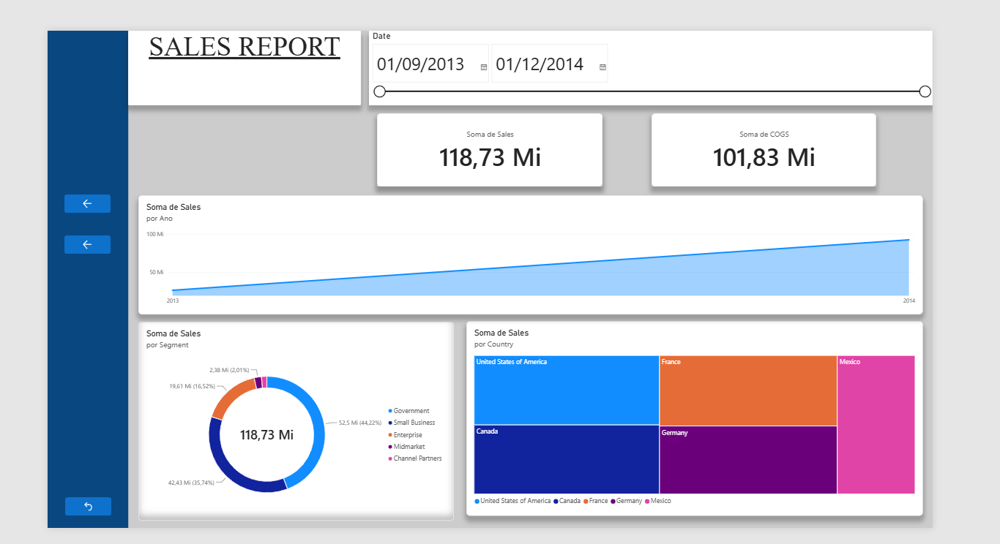
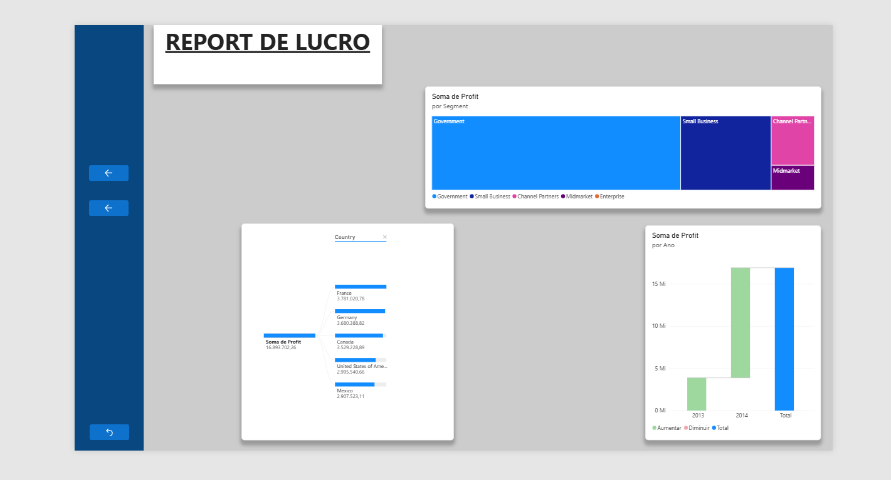

# Relatório Financeiro Interativo - Power BI

Este é o segundo projeto prático desenvolvido para a formação de Power BI Analyst da DIO. O objetivo principal deste desafio foi sair da criação básica de dashboards e aplicar recursos avançados de interatividade, navegação e design de layout.

A base de dados utilizada foi a `Financial Sample`, disponibilizada no próprio curso.

## O que foi desenvolvido

O projeto foi dividido em duas páginas focadas em métricas diferentes (Vendas e Lucro), com um menu lateral para facilitar a navegação. As principais técnicas aplicadas foram:

* **Layout Customizado:** Criação de um menu lateral fixo (barra azul) para os botões de navegação e formatação padronizada com sombras nos visuais.
* **Bookmarks (Indicadores):** Configuração de botões para alternar dinamicamente entre visuais diferentes (Gráfico de Área vs. Gráfico de Colunas) no mesmo espaço da tela, poupando espaço e melhorando a análise.
* **Navegação entre Páginas:** Uso de botões de ação para transitar entre a página de Vendas e a página de Lucros de forma fluida.
* **Visuais Avançados:** Aplicação de Árvore de Decomposição (Decomposition Tree) para análise exploratória e Gráfico de Cascata (Waterfall) para entender a variação de lucros por trimestre.

## Telas do Projeto

### Página 1: Visão de Vendas (Sales Report)
Foco no panorama geral de vendas, contendo filtro de datas, cartões de KPI (Sales e COGS), gráfico de anel por segmento e um mapa de árvore (Treemap) por país. É nesta tela que a funcionalidade de alternância de gráficos via botões está configurada.

### Página 2: Visão de Lucro (Profit Report)
Página dedicada ao detalhamento do lucro. Utiliza uma Árvore de Decomposição para quebrar o lucro total por Ano e depois por País, além de um Gráfico de Cascata e um Treemap focados no desempenho de lucro por segmento.

## Como visualizar

Devido a restrições de contas institucionais/estudante, este relatório não está publicado no Power BI Service. 

Para interagir com o dashboard, testar os botões e os indicadores:
1. Faça o download do arquivo `.pbix` disponível neste repositório.
2. Abra-o utilizando o **Power BI Desktop**.
3. No Power BI Desktop, se lembre de segurar a tecla CTRL ao clicar nos botões para ativar a navegação e a troca de gráficos.
